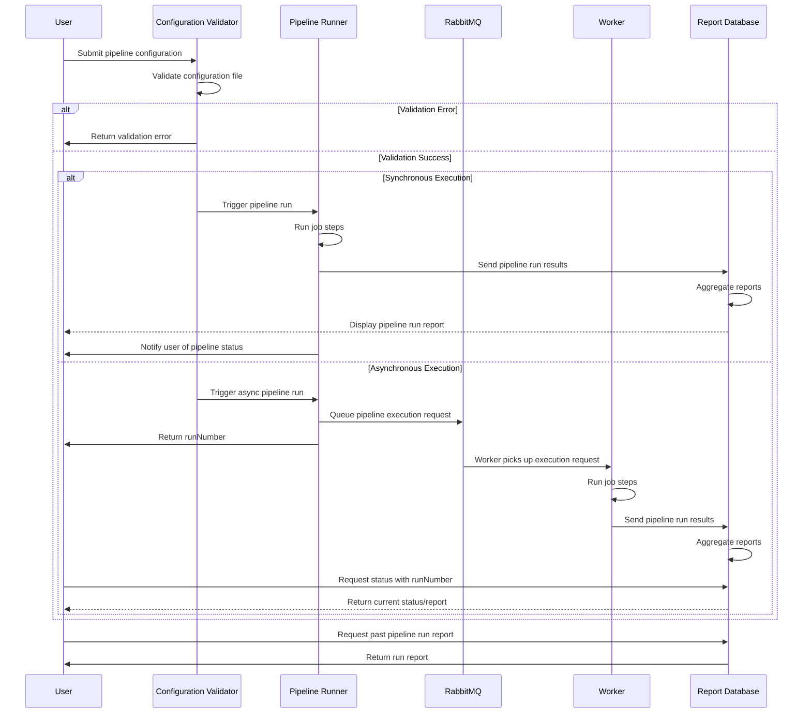

### Execution Flow

The main execution flow is that the user submits a configuration file with the pipeline steps. The file is validated by
the configuration validator and if valid is passed to the pipeline runner.

#### Synchronous Execution
In the synchronous mode, the runner runs through each step in the file
and sends the results of the run to the report database. Reports are stored here and returned to the user. The runner
also returns the status of the run (pass or fail) to the user.

#### Asynchronous Execution
In the asynchronous mode, after validation, the pipeline runner queues the execution request in RabbitMQ and immediately
returns a unique runNumber to the user. A worker process picks up the queued request from RabbitMQ and executes the
pipeline jobs. Results are sent to the report database as they are completed. The user can check the status of their
pipeline at any time using the status command with their runNumber.